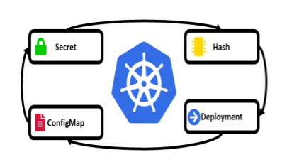

# k8s minikube whorkshop

## Table of Contents

0. [Create our cluster](#create-our-content)
1. [Nodes & Namespaces](#nodes--namespaces)
2. [Pods, ReplicaSet & Deployments](#pods-replicaset--deployments)
3. [ConfigMaps & Secrets](#configmaps--secrets)
<!-- 4. [Init Containters, Health & Resources Quotas]()
5. [Service & Ingress](#service--ingress)
6. [Storage](#storage)
7. [DaemonSet & StatefulSet]
8. [HPA](#hpa)
9. [Customize]-->

<!--

Presentation https://docs.google.com/presentation/d/1bZDzrIPnhK8qVwNvo8hw524POwHdrv1RUkoVeQWcNuQ/edit?usp=sharing
 -->

## Intro

> _"The best confidence builder is experience"_
>
> _"La mejor fuente de confianza es la experiencia"_

## Create our cluster

### Tools

For virtualization we need any driver. Check at https://minikube.sigs.k8s.io/docs/drivers/\
Exec: `make install_virt` to install kvm for ubuntu or hyperkit for macOS.

For commands we need some tools:
- Minikube
- Kubectl
- kubeseal
- Optionals: yq / jq
- Optionals: kubectx / kubens
- Optionals: watch / [kube-ps1](https://github.com/jonmosco/kube-ps1/blob/master/img/kube-ps1.gif)

Exec: `make install_tools` to install main tools tools.


### Auto-complete (Optional)

https://minikube.sigs.k8s.io/docs/commands/completion/
https://kubernetes.io/docs/tasks/tools/install-kubectl/#enabling-shell-autocompletion

``` zsh
################################
##           ZSH               #
################################

# zsh completion minikube/kubectl
autoload -U +X compinit && compinit
source <(minikube completion zsh)
source <(kubectl completion zsh) 
```

``` bash
################################
##           BASH  Ubuntu      #
################################

### Install bash-completion
# Bash Ubuntu +
sudo apt-get install bash-completion
```

``` bash
################################
##           BASH  MacOS       #
################################
# Bash maC
brew install bash-completion@2
```

``` bash
################################
##           BASH  Manjaro     #
################################
# Bash Arch/Manjaro
sudo pacman -S bash-completion
```

``` bash
################################
##           BASH              #
################################
## Load bash_completion
source /usr/share/bash-completion/bash_completion

# bash completion minikube/kubectl
source <(minikube completion bash)
source <(kubectl completion bash)
```

### Create Minikube Virtual Machine

``` bash
## Default options
minikube start
```

or

``` bash
minikube start --alsologtostderr --v $K8_LOG_LEVEL -p $K8_PROFILE_NAME \
    --memory $K8_MINIK_RAM_MB --cpus $K8_MINIK_CPU_NUM --disk-size $K8_MINIK_DISK \
    --driver $K8_MINIKUBE_DRIVER --kubernetes-version $K8_API_VERSION
```

### Addons

List 
``` bash
minikube -p workshop addons list
```

or

``` bash
minikube addons enable metrics-server --v=$K8_LOG_LEVEL -p $K8_PROFILE_NAME
```

### Check instalation

``` bash
make test_ingress
```

**Expects:**

```
Ingress OUT:

HTTP/1.1 200 OK
Date: ...
Content-Type: text/plain; charset=utf-8
Content-Length: 60
Connection: keep-alive

Hello, world!
Version: 1.0.0
Hostname: web-...
```

### Sealed Secrets CRD (Custom Resource Definition)

``` bash
make install_crds
```

**Expects:**

```
The value is: xyz
```

### Dashboard

``` bash
make dashboard
```

or

``` bash
minikube dashboard -p $K8_PROFILE_NAME
```

## Nodes & Namespaces

Kubernetes runs your workload by placing containers into Pods to run on **Nodes**. A node may be a virtual or physical machine, depending on the cluster.


Typically you have several nodes in a cluster; in a learning or resource-limited environment, you might have just one.


Kubernetes supports multiple virtual clusters backed by the same physical cluster. These virtual clusters are called namespaces.


**Namespaces** provide a scope for names. Names of resources need to be unique within a namespace, but not across namespaces. Namespaces cannot be nested inside one another and each Kubernetes resource can only be in one namespace.


### Practice 1 - Namespaces

Recomendations: Use `kubens`.

> scripts/part3_practices/practice_1_namespaces.sh

``` bash

## list namespaces
kubectl get namespaces

## The default namespace
kubectl get namespaces default

kubectl describe namespaces default

# Create a namespace
kubectl create namespace example-ns-1

# Show namespace information
kubectl describe namespaces example-ns-1

# Warning: This deletes everything under the namespace!
kubectl delete namespaces example-ns-1

## Create the development namespace using kubectl
kubectl create -f https://k8s.io/examples/admin/namespace-dev.json
kubectl delete -f https://k8s.io/examples/admin/namespace-dev.json
curl -L https://k8s.io/examples/admin/namespace-dev.json

kubectl create -f ./scripts/part3_practices/practice_1_namespaces.yaml
kubectl apply -f ./scripts/part3_practices/practice_1_namespaces.yaml

# dry-run
kubectl create -f ./scripts/part3_practices/practice_1_namespaces.yaml --dry-run=client

kubectl create -f ./scripts/part3_practices/practice_1_namespaces.yaml --dry-run=client -o json

```

Explore the files, play, enjoy! 😊

## Pods, ReplicaSet & Deployments

### Pods

**Pods** are the smallest deployable units of computing that you can create and manage in Kubernetes.


A **Pod** (as in a pod of whales or pea pod) **is a group of one or more containers, with shared storage and network resources, and a specification for how to run the containers**. A Pod models an application-specific "logical host": it contains one or more application containers which are relatively tightly coupled. In non-cloud contexts, applications executed on the same physical or virtual machine are analogous to cloud applications executed on the same logical host.


Usually you don't need to create Pods directly, even singleton Pods. Instead, create them using workload resources such as Deployment or Job.


Pods in a Kubernetes cluster are used in two main ways:

- Pods that run a single container
- Pods that run multiple containers that need to work together


### ReplicaSet

A **ReplicaSet**'s purpose is to maintain a stable set of replica Pods running at any given time. As such, it is often used to guarantee the availability of a specified number of identical Pods.

A **ReplicaSet** <u>is defined with fields</u>, including a selector that specifies how to identify Pods it can acquire, a number of replicas indicating how many Pods it should be maintaining, and a pod template specifying the data of new Pods it should create to meet the number of replicas criteria. A ReplicaSet then fulfills its purpose by creating and deleting Pods as needed to reach the desired number. When a ReplicaSet needs to create new Pods, it uses its Pod template.


### Deployment

A **Deployment** provides declarative updates for Pods and ReplicaSets.


You can define Deployments to create new ReplicaSets, or to remove existing Deployments and adopt all their resources with new Deployments.


### Practice 2

> scripts/part3_practices/practice_2_0_pods_deployments.sh

#### Pods

``` bash

### List PODS, create, list by namespace
kubectl get pods

kubectl get pods --namespace default
## Now try with watch command in diferent terminal
watch kubectl get pods -n workshop-ns

# create from yaml
kubectl apply -f ./scripts/part3_practices/practice_2_1_pods.yaml

kubectl get pods -n workshop-ns

kubectl get pod mypod
kubens workshop-ns
kubectl get pod mypod

kubectl get pod mypod -n workshop-ns
```

#### Deployments

``` bash
## List deployments, create

# List from all namespaces (-A) with extra information (-o wide) and waiting for changes (-w)
kubectl get deployments -A -o wide -w
# -o could be json, yaml, wide (to show more fields than standar), custom format, etc

# Create deploy from CLI
kubectl create deployment snowflake --image=k8s.gcr.io/serve_hostname  -n=workshop-ns --replicas=2
# Filter by labels
kubectl get pods -l app=snowflake -n=workshop-ns
# Describe
kubectl describe pods -l app=snowflake -n=workshop-ns
kubectl describe deployment snowflake -n=workshop-ns
# create from yaml
kubectl apply -f ./scripts/part3_practices/practice_2_2_deployment.yaml
```

## ConfigMaps & Secrets

### ConfigMap

A **ConfigMap** is an API object used to store non-confidential data in key-value pairs. Pods can consume ConfigMaps as environment variables, command-line arguments, or as configuration files in a volume.


> _**Caution**: ConfigMap does not provide secrecy or encryption. If the data you want to store are confidential, use a Secret rather than a ConfigMap, or use additional (third party) tools to keep your data private._

The name of a ConfigMap must be a valid [DNS subdomain name](https://kubernetes.io/docs/concepts/overview/working-with-objects/names/#dns-subdomain-names). Each key under the data or the binaryData field must consist of alphanumeric characters, -, _ or .. The keys stored in data must not overlap with the keys in the binaryData field.

- Use a ConfigMap for setting configuration data separately from application code.
- Multiple Pods can reference the same ConfigMap.
- When a ConfigMap currently consumed in a volume is updated, projected keys are eventually updated as well.
- ConfigMaps consumed as environment variables are not updated automatically and require a pod restart.


### Secrets

Kubernetes **Secrets** let you store and manage sensitive information, such as passwords, OAuth tokens, and ssh keys. 


A Secret is an object that contains a small amount of sensitive data such as a password, a token, or a key. Such information might otherwise be put in a Pod specification or in an image.



#### Type of Secrets

| Builtin Type                        | Usage                                 |
|-------------------------------------|---------------------------------------|
| Opaque                              | arbitrary user-defined data           |
| kubernetes.io/service-account-token | service account token                 |
| kubernetes.io/dockercfg             | serialized ~/.dockercfg file          |
| kubernetes.io/dockerconfigjson      | serialized ~/.docker/config.json file |
| kubernetes.io/basic-auth            | credentials for basic authentication  |
| kubernetes.io/ssh-auth              | credentials for SSH authentication    |
| kubernetes.io/tls                   | data for a TLS client or server       |
| bootstrap.kubernetes.io/token       | bootstrap token data                  |


### Sealed Secrets

**Problem:** "I can manage all my K8s config in git, except Secrets."

**Solution:** Encrypt your Secret into a SealedSecret, which is safe to store - even inside a public repository. The SealedSecret can be decrypted only by the controller running in the target cluster and nobody else (not even the original author) is able to obtain the original Secret from the SealedSecret.

Sealed Secrets is composed of two parts:

- A cluster-side controller / operator
- A client-side utility: kubeseal

The kubeseal utility uses asymmetric crypto to encrypt secrets that only the controller can decrypt.

These encrypted secrets are encoded in a SealedSecret resource, which you can see as a recipe for creating a secret. 


### Practice 3

> scripts/part3_practices/practice_3_0_config_secrets.sh

#### ConfigMap

``` bash
# Use the kubectl create configmap command to create ConfigMaps from directories, files, or literal values:
# Create the configmap from files
kubectl create configmap game-config-from-files -n workshop-ns \
    --from-file=samplefiles/ \
    --dry-run=client \
    --output=yaml

# Create the configmap from file like env vars
kubectl create configmap game-config-env-file -n workshop-ns \
    --from-env-file=samplefiles/game.properties \
    --dry-run=client \
    --output=yaml

# Create the configmap from literal like env vars
kubectl create configmap special-config -n workshop-ns \
    --from-literal=special.how=very --from-literal=special.type=charm \
    --dry-run=client \
    --output=yaml

# create the configmap & pod
kubectl apply -f ./scripts/part3_practices/practice_3_1_config.yaml

# List pods
kubectl get pods -n workshop-ns

# execute comand into pod to watch env vars (interactive terminal)
kubectl exec -ti  configmap-demo-pod -- sh

kubectl exec -n workshop-ns configmap-demo-pod -- env

# Excecute command to list and print files from configmap
kubectl exec -n workshop-ns configmap-demo-pod -- sh -c "ls /config/;cat /config/*"
```

#### Secrets

``` bash
mkdir -p tmp

kubectl create secret generic dev-db-secret \
  --from-literal=username=devuser \
  --from-literal=password='S!B\*d$zDsb=' \
  --dry-run=client \
  --output=yaml \
  --namespace=workshop-ns > tmp/dev-db-secret.yaml

cat tmp/dev-db-secret.yaml

kubens workshop-ns
kubectl apply -f tmp/dev-db-secret.yaml
kubectl get secrets


#### FROM FILE
cat > tmp/server_cert.pem <<EOF
-----BEGIN CERTIFICATE-----
MIIEczCCA1ugAwIBAgIBADANBgkqhkiG9w0BAQQFAD..AkGA1UEBhMCR0Ix
EzARBgNVBAgTClNvbWUtU3RhdGUxFDASBgNVBAoTC0..0EgTHRkMTcwNQYD
VQQLEy5DbGFzcyAxIFB1YmxpYyBQcmltYXJ5IENlcn..XRpb24gQXV0aG9y
aXR5MRQwEgYDVQQDEwtCZXN0IENBIEx0ZDAeFw0wMD..TUwMTZaFw0wMTAy
MDQxOTUwMTZaMIGHMQswCQYDVQQGEwJHQjETMBEGA1..29tZS1TdGF0ZTEU
MBIGA1UEChMLQmVzdCBDQSBMdGQxNzA1BgNVBAsTLk..DEgUHVibGljIFBy
aW1hcnkgQ2VydGlmaWNhdGlvbiBBdXRob3JpdHkxFD..AMTC0Jlc3QgQ0Eg
THRkMIIBIjANBgkqhkiG9w0BAQEFAAOCAQ8AMIIBCg..Tz2mr7SZiAMfQyu
vBjM9OiJjRazXBZ1BjP5CE/Wm/Rr500PRK+Lh9x5eJ../ANBE0sTK0ZsDGM
ak2m1g7oruI3dY3VHqIxFTz0Ta1d+NAjwnLe4nOb7/..k05ShhBrJGBKKxb
8n104o/5p8HAsZPdzbFMIyNjJzBM2o5y5A13wiLitE..fyYkQzaxCw0Awzl
kVHiIyCuaF4wj571pSzkv6sv+4IDMbT/XpCo8L6wTa..sh+etLD6FtTjYbb
rvZ8RQM1tlKdoMHg2qxraAV++HNBYmNWs0duEdjUbJ..XI9TtnS4o1Ckj7P
OfljiQIDAQABo4HnMIHkMB0GA1UdDgQWBBQ8urMCRL..5AkIp9NJHJw5TCB
tAYDVR0jBIGsMIGpgBQ8urMCRLYYMHUKU5AkIp9NJH..aSBijCBhzELMAkG
A1UEBhMCR0IxEzARBgNVBAgTClNvbWUtU3RhdGUxFD..AoTC0Jlc3QgQ0Eg
THRkMTcwNQYDVQQLEy5DbGFzcyAxIFB1YmxpYyBQcm..ENlcnRpZmljYXRp
b24gQXV0aG9yaXR5MRQwEgYDVQQDEwtCZXN0IENBIE..DAMBgNVHRMEBTAD
AQH/MA0GCSqGSIb3DQEBBAUAA4IBAQC1uYBcsSncwA..DCsQer772C2ucpX
xQUE/C0pWWm6gDkwd5D0DSMDJRqV/weoZ4wC6B73f5..bLhGYHaXJeSD6Kr
XcoOwLdSaGmJYslLKZB3ZIDEp0wYTGhgteb6JFiTtn..sf2xdrYfPCiIB7g
BMAV7Gzdc4VspS6ljrAhbiiawdBiQlQmsBeFz9JkF4..b3l8BoGN+qMa56Y
It8una2gY4l2O//on88r5IWJlm1L0oA8e4fR2yrBHX..adsGeFKkyNrwGi/
7vQMfXdGsRrXNGRGnX+vWDZ3/zWI0joDtCkNnqEpVn..HoX
-----END CERTIFICATE-----
EOF

cat > tmp/server_token.properties <<EOF
username=admin
password=admin123
EOF

kubectl create secret generic dev-server-creds \
  --from-file=certificate.pem=tmp/server_cert.pem \
  --from-file=access_token.properties=tmp/server_token.properties \
  --dry-run=client \
  --output=yaml \
  --namespace=workshop-ns > tmp/dev-server-credentials.yaml
cat tmp/dev-server-credentials.yaml

echo

kubectl apply -f tmp/dev-server-credentials.yaml

# Decoding the Secret https://kubernetes.io/docs/tasks/configmap-secret/managing-secret-using-kubectl/#decoding-secret
kubectl get secret dev-server-creds -o jsonpath='{.data}'
echo
kubectl get secret dev-server-creds -o jsonpath='{.data.access_token\.properties}'
echo
kubectl get secret dev-server-creds -o jsonpath='{.data.certificate\.pem}'
echo
echo

CERTIFICATE_B64=$(kubectl get secret dev-server-creds -o jsonpath='{.data.certificate\.pem}')
CERTIFICATE_PLAIN=$(echo ${CERTIFICATE_B64} | base64 --decode)
echo "$CERTIFICATE_PLAIN"

kubens workshop-ns

kubectl apply -f ./scripts/part3_practices/practice_3_2_secrets.yaml


kubectl exec -n workshop-ns secret-env-pod -- env
kubectl exec -n workshop-ns secret-env-pod -- ls

# Enter & keep in bash (interactive terminal)
kubectl exec -n workshop-ns secret-env-pod -it -- bash

# Excecute comand in bash and exit
kubectl exec -n workshop-ns secret-env-pod -- bash -c "ls /etc/foo; echo; cat /etc/foo/*"
```

## References

- https://minikube.sigs.k8s.io/docs/drivers/

- https://github.com/bitnami-labs/sealed-secrets

- https://github.com/jonmosco/kube-ps1

##### Minikube Start
- https://minikube.sigs.k8s.io/docs/start/

##### Minikube Commands
- https://minikube.sigs.k8s.io/docs/commands/

##### Completion
- https://kubernetes.io/docs/tasks/tools/install-kubectl/#enabling-shell-autocompletion
- https://minikube.sigs.k8s.io/docs/commands/completion/

##### Others
- https://kubernetes.io/docs/tasks/configure-pod-container/pull-image-private-registry/#create-a-pod-that-uses-your-secret
- https://akuity.io/blog/how-to-manage-kubernetes-secrets-gitops/
